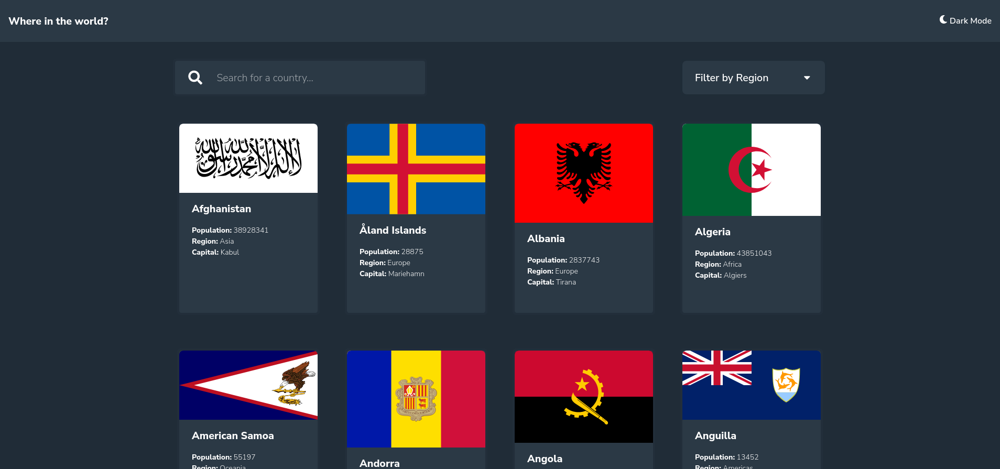

# Frontend Mentor - REST Countries API with color theme switcher solution

This is a solution to the [REST Countries API with color theme switcher challenge on Frontend Mentor](https://www.frontendmentor.io/challenges/rest-countries-api-with-color-theme-switcher-5cacc469fec04111f7b848ca). Frontend Mentor challenges help you improve your coding skills by building realistic projects.

## Table of contents

- [Overview](#overview)
  - [The challenge](#the-challenge)
  - [Screenshot](#screenshot)
  - [Links](#links)
- [React](#react-readme)
- [My process](#my-process)
  - [Built with](#built-with)
  - [What I learned](#what-i-learned)
  - [Continued development](#continued-development)
  - [Useful resources](#useful-resources)
- [Author](#author)
- [Acknowledgments](#acknowledgments)

---

## Overview

### The challenge

Users should be able to:

- See all countries from the API on the homepage
- Search for a country using an `input` field
- Filter countries by region
- Click on a country to see more detailed information on a separate page
- Click through to the border countries on the detail page
- Toggle the color scheme between light and dark mode _(optional)_

### Screenshot

### Links

- Solution URL: [https://frontendmentor.io/profile/whoamihealay/solutions](https://www.frontendmentor.io/profile/whoamihealay/solutions)
- Live Site URL: [https://whoamihealay.github.io/rest-countries-api](https://whoamihealay.github.io/rest-countries-api)

---

## React README

### `npm start`

Runs the app in the development mode.\
Open [http://localhost:3000](http://localhost:3000) to view it in the browser.

### `npm test`

Launches the test runner in the interactive watch mode.\
See the section about [running tests](https://facebook.github.io/create-react-app/docs/running-tests) for more information.

### `npm run build`

Builds the app for production to the `build` folder.\
It correctly bundles React in production mode and optimizes the build for the best performance.

The build is minified and the filenames include the hashes.\
Your app is ready to be deployed!

See the section about [deployment](https://facebook.github.io/create-react-app/docs/deployment) for more information.

### `npm run eject`

**Note: this is a one-way operation. Once you `eject`, you can’t go back!**

If you aren’t satisfied with the build tool and configuration choices, you can `eject` at any time. This command will remove the single build dependency from your project.

Instead, it will copy all the configuration files and the transitive dependencies (webpack, Babel, ESLint, etc) right into your project so you have full control over them. All of the commands except `eject` will still work, but they will point to the copied scripts so you can tweak them. At this point you’re on your own.

You don’t have to ever use `eject`. The curated feature set is suitable for small and middle deployments, and you shouldn’t feel obligated to use this feature. However we understand that this tool wouldn’t be useful if you couldn’t customize it when you are ready for it.

### Learn More

You can learn more in the [Create React App documentation](https://facebook.github.io/create-react-app/docs/getting-started).

To learn React, check out the [React documentation](https://reactjs.org/).

---

## My process

### Built with

- Semantic HTML5 markup
- CSS custom properties
- Flexbox
- CSS Grid
- Mobile-first workflow
- [React](https://reactjs.org/) - JS library
- [Axios](https://axios-http.com/) - JS library
- [Context](https://reactjs.org/docs/context.html) - JS library

### What I learned

- Context
- API needs for frontend
- Error handling

### Continued development

Use this section to outline areas that you want to continue focusing on in future projects. These could be concepts you're still not completely comfortable with or techniques you found useful that you want to refine and perfect.

### Useful resources

- [React Docs](https://reactjs.org/docs/getting-started.html) - The docs for React are solid,I mainly used them to look up the new hooks! Reading the framework/library docs is my go-to and has never failed me! Definite recommend!
- [React Context Docs](https://reactjs.org/docs/context.html) - This was my first use of the Context library. I have used Redux so I wasn't completely lost and I'm very impressed at how easy it was to implement. (See was I call the Brad Taversy "System" for more info)
- [Axios Docs](https://axios-http.com/docs/intro) - Axios is amazing! It just works! The document is clear and concise! I use Axios for my HTTP request to the API and never had an issue with it.
- [React Route V6 Docs](https://reactrouter.com/docs/en/v6/upgrading/v5) - I didn't even realize until a Switch didn't work that install version 6 of React-Router-dom. And instead of rolling back to version 5, I went with it. Thanks to their amazing Upgrade to V6 documentation, I was quickly back on track. I haven't fully used all the new possibilities (especially on Routes) but hope to do so in some refactoring.
- [Fireship.io](https://www.youtube.com/c/Fireship) - Awesome Youtube channel. Fireship.io has a "Concept/framework in 100sec" playlist to quickly learn the very basics of a Programming language, framework, or concept. There are also longer videos for more in-depth frontend mini-projects (CSS grid, flex...)
- [Brad Taversy](https://www.youtube.com/c/TraversyMedia) - Awesome Youtube Channel and Udemy course on react and the Context library. I followed his React Crash Course and Udemy course on React. His implementation of Context is what I used and I feel very comfortable with it. It has a redux feel and I love it!
- [Kevin Powell](https://www.youtube.com/kepowob) - Discovered on FrontendMentor with the partnership on the Space challenge and where my CSS game step up to all new level (Have a look at my other challenges to see the differences)
- [Google](google.com) - Last but not least, the ultimate bug solver!

## Author

- Website - [whoamihealay](https://whoamihealay.com/)
- Frontend Mentor - [@whoamihealay](https://www.frontendmentor.io/profile/whoamihealay)
- Linkedin - [@andrewsouthern01](https://www.linkedin.com/in/andrewsouthern01/)

## Acknowledgments

This is where you can give a hat tip to anyone who helped you out on this project. Perhaps you worked in a team or got some inspiration from someone else's solution. This is the perfect place to give them some credit.
